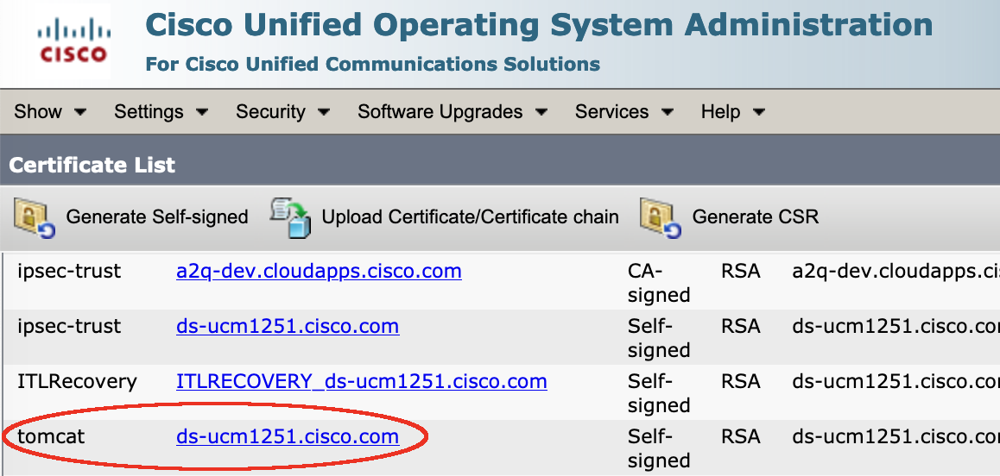
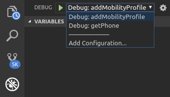

# axl-java-samples

## Overview

Sample Visual Studio Code project demonstrating usage of the Cisco CUCM AXL SOAP API using OpenJDK 11 and the Eclipse EEE4J JAX-WS packages.

Visit the [AXL Developer Site](https://developer.cisco.com/site/axl/)

This project was tested using:

* Ubuntu 20.10 / Mac 10.15.6
* OpenJDK 11
* Eclipse EEE4J Metro JAX-WS

>Note: the `java8` branch is available for supporting Oracle Java 8, however the Redhat Java plugin for VS Code no longer supports Java 8, so the project may not run with VS Code

## Available samples

* `getPhone.java` - Demonstrates querying for configuration information for a specific phone by device name (`<getPhone>`)

* `addMobilityProfile.java` - Add a new Mobility Profile (`<addMobilityProfile>`, `<removeMobilityProfile>`)

* `executeSqlQuery.java` - Performs an executeSqlQuery operation for the applicationusers table and extracts the name and pkid from the response  (`<executeSqlQuery>`)

* `getEnterprisePhoneConfig.java` - Performs a `<getEnterprisePhoneConfig>`, then parses/prints a simple report to the console.

* `addCtiRoutePoint.java` - Performs `<addLine>`, then creates a new CTI Route Point using the line with `<addCtiRoutePoint>`.

* `addPhone.java` - Performs `<addLine>`, then creates a new CTI Port using the line with `<addPhone>`.

* `addAppUser.java` - Performs `<addLine>` and `<addPhone>` with the new line, then creates an Application User with the new device assigned.

## Getting started

1. Make sure you have OpenJDK 11 installed, `java` is available in the path, and the JAVA_HOME environment variable is set:

    ```shell
    $ java -version
    # Example output
    openjdk version "11.0.8" 2020-07-14
    OpenJDK Runtime} Environment AdoptOpenJDK (build 11.0.8+10)
    OpenJDK 64-Bit Server VM AdoptOpenJDK (build 11.0.8+10, mixed mode)
    ```

    ```shell
    $ echo $JAVA_HOME
    # Example output
    /Library/Java/JavaVirtualMachines/adoptopenjdk-11.jdk/Contents/Home
    ```

1. Open a terminal and use `git` to clone this repository:

    ```bash
    git clone https://github.com/CiscoDevNet/axl-java-samples.git
    ```

1.  If you need to use Oracle JDK8, checkout branch `java8` (future additional samples may appear only in branch `master`, currently supporting OpenJDK 11):

    ```bash
    cd axl-java-samples
    git checkout java8
    ```

1. Download the CUCM Tomcat HTTPS certificate and place in the `certificate/` folder:

    1. Browse to the CUCM OS admin web pages: `https://{cucm}/cmplatform/showHome.do`

    1. Navigate to **Security** / **Certificate Management**

    1. Click **Find** and select the **tomcat** item:

        

    1. Click **Download .PEM File**, and save into this project's `certificate/` folder.  You may want to give it a recognizable name e.g. the CUCM host name.

1. Import the CUCM Tomcat HTTPS certificate into a local Java keystore.

    >Note: you may want to first copy the default Java `cacerts` file from `$JAVA_HOME/lib/security/cacerts` to `certificates/cacerts` to retain the default certs that ship with Java.  Be sure to set file ownership appropriately.

    The following command works on Ubuntu/Mac, see the Oracle Java documentation for more info on managing Java certificates. Be sure to replace `{CUCM_NAME}` and `{CERT_FILE_NAME}` with your particular values:

    ```bash
    $JAVA_HOME/bin/keytool -trustcacerts -keystore certificate/cacerts -alias {CUCM_NAME} -import -file certificate/{CERT_FILE_NAME}
    ```

    >Note: the default password for the default `cacerts` keystore is: `changeit`

1. The CUCM 12.5 version of the AXL WSDL files are included in this proect.  If want to use a different AXL version, download the AXL WSDL files for your CUCM version:

    1. From the CUCM Administration UI, download the 'Cisco AXL Tookit' from **Applications** / **Plugins**

    1. Unzip the Toolkit, and navigate to the `schema/current` folder

    1. Copy/replace the three WSDL files into this project's `schema/` folder:

        ```bash
        AXLAPI.wsdl
        AXLEnums.xsd
        AXLSoap.xsd
        ```

1. Open the `axl-java-samples` Java project in [Visual Studio Code](https://code.visualstudio.com/):

    ```bash
    code .
    ```

1.  If you haven't developed Java with VS Code before, you may need to install the 'Java Extention Pack' (vscjava.vscode) extension.

    Upon first opening the project in VS Code, click 'Yes' import the project into the workspace, then allow some time for VS Code and Maven to auto-generate the AXL API source/code from the AXL WSDL.

1. Once the AXL API source files have been automatically generated (found under `src/main/java/com/cisco/apxsamples/api/`), and compiled (found under `target/classes/com/cisco/axlsamples/api/`):

    * From the file **Explorer** tab, highlight `pom.xml`.
    
    * Open the VS Code command window and run the **Java: Update project configuration** command.
  
1. Rename the `.env.example` file to `.env`, and edit it to specify your CUCM hostname and AXL API user credentials.

    >Note: you can specify the config values as environment variables using your preferred method, if desired

1. Finally, to launch one of the available samples, in VS Code select the **Debug** panel, choose a launch configuration from the dropdown-list in the upper-left, and click the green **Start Debugging** arrow:

    

## Hints

* Samples include AXL XML request/response debugging functionaly.  To enable set `DEBUG=True` in `.env`

* The AXL schema is huge, and will consume a lot of memory during compilation and execution, including for things like Intellisense.  You may see better performance in VS Code by increasing the max memory allowed for the VS Code Java engine via the `settings.json` file, e.g. to allocate 8GB of max memory:

    ```json
    "java.jdt.ls.vmargs": "-Xmx8G -Xms100m"
    ```